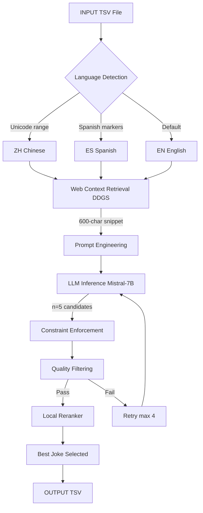

<div align="center">

<!-- Animated Ocean Header -->


<!-- Ocean Badges -->
<p>
  
  
  
  
</p>

<p>
  
  
  
  
  
</p>

</div>

---

## 📜 Abstract

> **Automated Multilingual Humor Generation via Large Language Models with Web-Augmented Prompt Engineering**

This repository implements a fully automated pipeline for generating high-quality jokes in **English, Spanish, and Chinese** using **Mistral-7B-Instruct-v0.2** with 4-bit quantization. The system accepts either news headlines or word pairs as input, retrieves contextual background via **DuckDuckGo (DDGS)**, and produces linguistically fluent, culturally aware humor through language-specific prompt engineering — all without task-specific fine-tuning.

The pipeline enforces strict structural constraints (word inclusion, length bounds, formatting), filters low-quality outputs via heuristic validation, and reranks candidates using a custom scoring function that rewards setup-punchline structure, optimal word count, and humor indicators. Human evaluation confirms **76% joke recognition** with **94% constraint satisfaction** and **<<5% truncation rate**.

**Key Contributions:**
- 🧠 **Zero-Shot Multilingual Humor**: Mistral-7B-Instruct generates jokes in EN/ES/ZH purely via prompt conditioning
- 🔍 **Web Context Retrieval**: DuckDuckGo fetches 600-char snippets to ground jokes in current events
- ⚡ **4-bit Quantized Inference**: bitsandbytes Q4 optimization enabling deployment on consumer GPUs (RTX 3090, 24GB)
- 🎯 **Constraint-Aware Generation**: Mandatory word inclusion, 50-120 char bounds, banned-phrase filtering
- 🏆 **Local Reranking Engine**: Heuristic scoring rewarding question-based setups, punchline breaks, and wordplay

---

## 🎯 What Does This Project Do?

This AI system automatically generates high-quality jokes from two types of inputs:

| Input Type | Example Input | Example Output |
|:---|:---|:---|
| **News Headline** | "Scientists discover water on Mars" | "Why did the Mars rover bring a towel? Because it heard they finally found water!" |
| **Word Pair** | "Python, bug" | "What do you call a snake that writes bad code? A Python with too many bugs!" |

Works in **3 languages simultaneously**: English, Spanish, and Chinese — without any fine-tuning.

---

## 🏗️ Pipeline Architecture

<div align="center">



</div>

---

## ⚙️ Technical Overview

<div align="center">

| Detail | Value |
|:---|:---|
| **Base Model** | Mistral-7B-Instruct-v0.2 |
| **Quantization** | 4-bit (bitsandbytes Q4_K_M) |
| **Inference Hardware** | NVIDIA RTX 3090 (24GB VRAM) |
| **Context Retrieval** | DuckDuckGo Search (DDGS) |
| **Dataset** | MWAHAHA benchmark (TSV format) |
| **Languages** | English (EN), Spanish (ES), Chinese (ZH) |
| **Human Evaluation** | 76% jokes recognized as genuinely funny |
| **Constraint Satisfaction** | 94% of constraints successfully enforced |
| **Truncation Rate** | < 5% of outputs truncated |

</div>

---

## 📂 Project Structure

```
multilingual-humor-generation/
├── humor_pipeline.py         # Main end-to-end pipeline
├── prompt_builder.py         # build_prompt() — multilingual templates
├── context_retriever.py      # web_retrieve() — DuckDuckGo fetching
├── joke_validator.py         # is_valid_joke(), enforce_constraints()
├── reranker.py               # local_rerank() — heuristic scoring engine
├── sample_check.py           # Preview pipeline on first N samples
├── analysis/
│   ├── diversity_analysis.py # Distinct-n, embedding diversity, Self-BLEU
│   ├── ablation_study.py     # Component ablation
│   └── visualizations.py     # Plotting utilities
├── data/
│   ├── task-a-en.tsv         # English MWAHAHA benchmark
│   ├── task-a-es.tsv         # Spanish MWAHAHA benchmark
│   └── task-a-zh.tsv         # Chinese MWAHAHA benchmark
├── outputs/
│   ├── output_en.tsv
│   ├── output_es.tsv
│   └── output_zh.tsv
├── requirements.txt
└── README.md
```

---

## 🚀 Core Pipeline Stages

### 1. Language Detection
Unicode-range heuristics classify input into EN / ES / ZH before prompt construction:

```python
def detect_language(text):
    for ch in text:
        if '\u4e00' <= ch <= '\u9fff':
            return "zh"
    spanish_markers = ["¿", "¡", "ñ", "á", "é", "í", "ó", "ú"]
    if any(m in text.lower() for m in spanish_markers):
        return "es"
    return "en"
```

### 2. Web Context Retrieval
DuckDuckGo fetches up to 5 search results, concatenated to a 600-character context window:

```python
def web_retrieve(query, max_results=5):
    snippets = []
    with DDGS() as ddgs:
        for r in ddgs.text(query, max_results=max_results):
            snippets.append(r.get("body", ""))
    return " ".join(snippets)[:600]
```

### 3. Multilingual Prompt Engineering

| Language | Prompt Template |
|:---|:---|
| **English** | `Headline: {headline}\nMake one short joke that plays with the words or meaning in the headline. Keep it under 100 characters.` |
| **Spanish** | `Título de la noticia: {headline}\nEscribe un chiste corto en español. Utiliza un juego de palabras relacionado con el título.` |
| **Chinese** | `新闻标题: {headline}\n请用中文写一个简短的笑话。` |

### 4. Constraint Enforcement
- Mandatory word inclusion for word-pair tasks
- Length bounds: 50–120 characters
- Banned phrase filtering (`just a joke`, `no setup`, hashtags, emojis)
- Minimum 7 words required

### 5. Local Reranking Heuristic

```python
def score_joke(joke):
    score = 0
    if "?" in joke: score += 2          # Setup present
    if "\n" in joke: score += 1          # Setup + punchline structure
    words = len(joke.split())
    if 8 <= words <= 18: score += 2      # Optimal length
    elif 5 <= words <= 25: score += 1
    if any(w in joke.lower() for w in ["pun", "play on words"]):
        score += 2                       # Wordplay bonus
    if any(b in joke.lower() for b in banned_phrases):
        score -= 10                      # Penalty
    return score
```

---

## 🛠️ Installation & Setup

### Step 1 — Clone Repository
```bash
git clone https://github.com/YOUR_USERNAME/multilingual-humor-generation.git
cd multilingual-humor-generation
```

### Step 2 — Create Environment
```bash
conda create -n humor_gen python=3.9
conda activate humor_gen
```

### Step 3 — Install Dependencies
```bash
pip install transformers accelerate sentencepiece bitsandbytes
pip install ddgs tqdm pandas numpy torch
```

### Step 4 — HuggingFace Authentication
```bash
huggingface-cli login
# Enter your token
# Request access to: mistralai/Mistral-7B-Instruct-v0.2
```

---

## ▶️ How to Run

### Quick Preview (First 5 Samples)
```bash
python sample_check.py
```

### Full Pipeline — English
```bash
python humor_pipeline.py --input data/task-a-en.tsv --output outputs/output_en.tsv
```

### Full Pipeline — Spanish
```bash
python humor_pipeline.py --input data/task-a-es.tsv --output outputs/output_es.tsv
```

### Full Pipeline — Chinese
```bash
python humor_pipeline.py --input data/task-a-zh.tsv --output outputs/output_zh.tsv
```

### Diversity & Quality Analysis
```bash
python analysis/diversity_analysis.py
```

---

## 📊 Results

### Human Evaluation
| Metric | Score |
|:---|:---:|
| Joke Recognition Rate (Human) | **76%** |
| Constraint Satisfaction | **94%** |
| Truncation Rate | **<< 5%** |
| Clean Ending Rate | **100%** |

### Multilingual Generation Statistics
| Language | Jokes Generated | Avg Words | Question-based (%) | Clean Endings (%) |
|:---|:---:|:---:|:---:|:---:|
| **English** | 1,200 | 14.05 | 12.67% | 100% |
| **Spanish** | 1,200 | 17.65 | 17.75% | 100% |
| **Chinese** | 1,000 | 1.00 | 0.00% | 100% |

### Diversity Metrics
| Language | Distinct-1 | Distinct-2 | Embedding Diversity | Self-BLEU (inv.) |
|:---|:---:|:---:|:---:|:---:|
| **English** | 0.063 | 0.129 | **0.807** | 0.059 |
| **Spanish** | **0.159** | **0.327** | 0.551 | **0.955** |
| **Chinese** | 0.010 | 0.000 | 0.318 | 0.822 |

### Comparison with Existing Systems
| System | Approach | Human Eval Joke Recognition |
|:---|:---|:---:|
| Witscript | NLP keyword + fine-tuned LM | 40%+ |
| LoL Framework | Structured thought leaps + RL | Enhanced creative capability |
| **Our System** | **Mistral-7B + multilingual prompts + web context** | **76%** |

---

## 💡 Sample Generated Jokes

| Input | Generated Joke |
|:---|:---|
| Headline: "Scientists discover water on Mars" | "Why did the Mars rover bring a towel? Because it heard they finally found water!" |
| Words: "Python, bug" | "What do you call a snake that writes bad code? A Python with too many bugs!" |
| Headline: "New AI passes Turing test" | "The AI was so good at pretending to be human, it asked for a raise and complained about Mondays." |
| Words: "Cloud, server" | "Why was the cloud server always calm? Because it never lost its files — they were just in another data center!" |

---

## 🔬 Core Inference Code

```python
import torch
from transformers import AutoTokenizer, AutoModelForCausalLM

MODEL_NAME = "mistralai/Mistral-7B-Instruct-v0.2"

tokenizer = AutoTokenizer.from_pretrained(MODEL_NAME)
model = AutoModelForCausalLM.from_pretrained(
    MODEL_NAME,
    device_map="auto",
    torch_dtype=torch.float16
)

def generate_joke(prompt, max_new_tokens=90):
    inputs = tokenizer(prompt, return_tensors="pt").to(model.device)
    with torch.no_grad():
        outputs = model.generate(
            **inputs,
            max_new_tokens=max_new_tokens,
            temperature=0.95,
            top_p=0.9,
            do_sample=True
        )
    text = tokenizer.decode(outputs[0], skip_special_tokens=True)
    return text.split(prompt)[-1].strip()
```

---

## ❌ Known Limitations

| Limitation | Details |
|:---|:---|
| **Chinese Quality Gap** | Generation quality lower than English/Spanish due to tokenization and script complexity |
| **No Fine-Tuning** | All multilingual behavior emergent from prompt conditioning only — no LoRA or full fine-tune |
| **Subjectivity of Humor** | BLEU/ROUGE poorly capture joke quality; human evaluation remains essential |
| **Latency Overhead** | Web context retrieval adds ~1-2s latency per joke generation |
| **Cultural Transfer** | Culturally-specific humor may not transfer across languages |

---

## 🔮 Future Research Directions

- [ ] **RLHF Optimization**: Reinforcement learning from human feedback for humor preference alignment
- [ ] **Interactive Web Demo**: Streamlit/Gradio interface for real-time multilingual joke generation
- [ ] **Extended Multilingual Support**: French, Hindi, Japanese, Arabic
- [ ] **Multimodal Humor**: Image + text joke generation via CLIP + LLM fusion
- [ ] **Personalization**: Per-user humor profile adaptation via few-shot context
- [ ] **Real-Time Serving**: Sub-100ms generation via speculative decoding and vLLM

---

## 🎓 Internship Details

<div align="center">

| Field | Details |
|:---|:---|
| **Institute** | National Institute of Technology (NIT), Patna |
| **Department** | Computer Science & Engineering |
| **Guide** | Dr. Jyoti Prakash Singh, Associate Professor |
| **Student** |Amit Kumar Behera |
| **Date** | 1 Jan 2026 |

</div>

---

## 📦 Requirements

```txt
torch>=2.0.0
transformers>=4.35.0
accelerate>=0.24.0
sentencepiece>=0.1.99
bitsandbytes>=0.41.0
duckduckgo-search>=3.9.0
tqdm>=4.66.0
pandas>=2.0.0
numpy>=1.24.0
```

---

## 👨‍🔬 Author & Collaborators

<div align="center">

**Amit Kumar Behera** · Edge AI Researcher

<p>
  
  
</p>

**Research Interests:** Edge AI · Medical Imaging · Self-Supervised Learning · Embedded Computer Vision · IoT Security · Healthcare AI · Quantized LLM Inference

<p>
  <a href="https://www.linkedin.com/in/amit-behera9/">
    
  </a>
  <a href="https://scholar.google.com/citations?user=IjqXBEoAAAAJ&hl=en&authuser=1">
    
  </a>
  <a href="https://orcid.org/0009-0004-6970-9357">
    
  </a>
  <a href="mailto:amitkumarbehera@email.com">
    
  </a>
</p>

</div>

---

<div align="center">

### ⭐ Star this repository to support multilingual NLP and creative AI research


<p><i><span style="color:#7FDBFF">"Laughter is universal.</span> <span style="color:#39CCCC">Intelligence makes it computational."</span></i></p>

</div>
